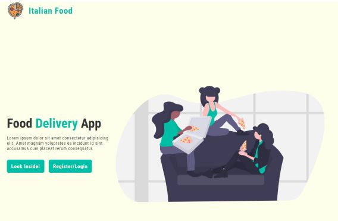
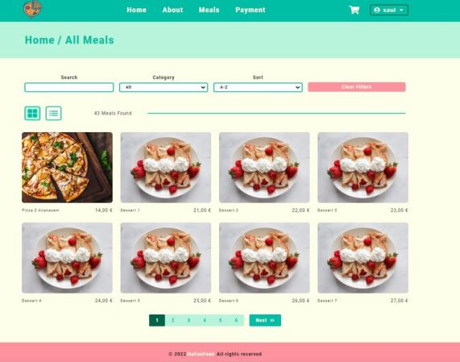
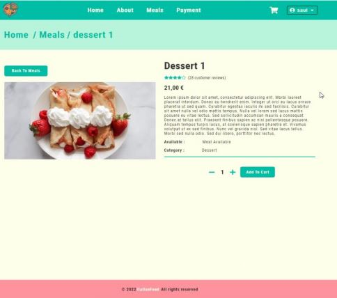

## Italian Food - Restaurant App

This app was my engineering thesis in college.
It was written in React. I used styled-components to style the application.

In the application I created functionalities such as:

-   Registration/Login
-   Admin panel with CRUD operations
-   Meal search, sorting, filtering, pagination

The application used the REST API, which I also wrote myself as part of an engineering thesis. (It is available in another repository).

